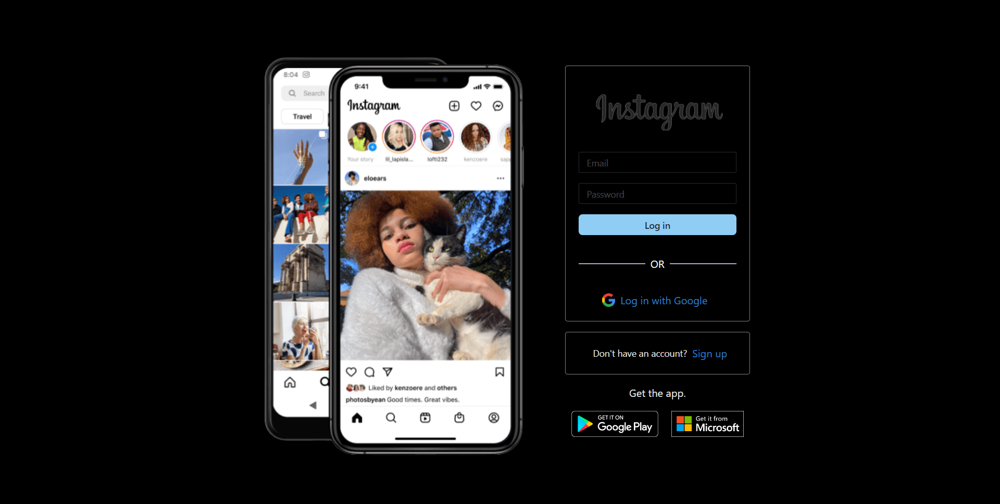
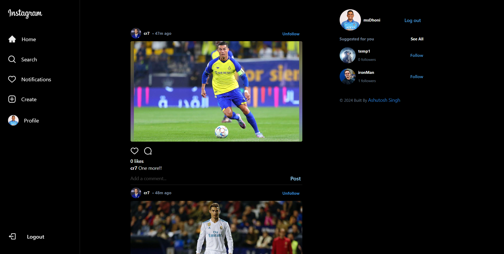
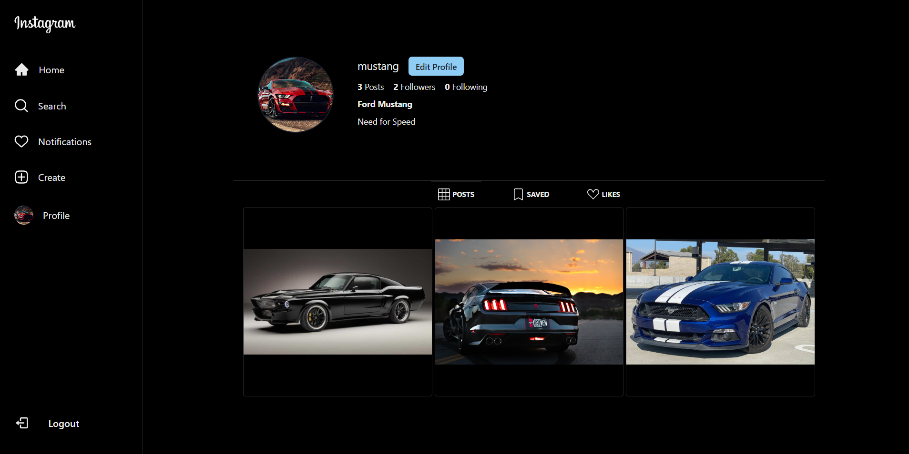

# Instagram-Clone

Instagram-Clone is a fully-featured web application that replicates the core functionality of the popular social media platform, Instagram. This project allows users to experience a comprehensive set of social media features, including user authentication, profile customization, post creation, and real-time interactions.

## Live Demo

You can view the live demo of the app at: [Click Here](https://clone-social.vercel.app/)

## Screenshots

### Authentication Page

### Home Page

### Profile Page

## Technologies & Tools

- **React**: A JavaScript library for building user interfaces.
- **Vite**: A fast and lightweight build tool that provides an efficient development experience.
- **ChakraUI**: A simple, modular and accessible component library that provides the building blocks to create React applications with speed.
- **Firebase**: A comprehensive app development platform that provides a Realtime Database, Authentication, Hosting, and more (Backend services).
- **Zustand**: A small, fast, and scalable state management solution.
- **Git**: A distributed version control system for tracking changes in source code during software development.
- **Vercel**: A cloud platform for static sites and Serverless Functions that accelerates development and simplifies the deployment process.

## Features

The application offers a range of features that closely match the original Instagram experience, including:

- User authentication
- Profile customization
- Post creation
- Real-time interactions
- All the basic functionalities that Instagram provides
- Fully responsive design for optimal viewing on any device
- Sleek and intuitive user interface (UI) and user experience (UX)

## Project Structure

The project structure is as follows:

- `public`: Holds the static assets.
- `Screenshots`: Holds the project screenshots.
- `src/assets`: Contains all the logos used throughout the app.
- `src/components`: Contains all the reusable components used throughout the application.
- `src/firebase`: Contains firebase configurations
- `src/hooks`: Holds all the custom hooks used throughout the application.
- `src/Layouts`: Contains the custom layouts for different pages.
- `src/pages`: Holds the main pages of the application, such as the login, profile, and feed pages.
- `src/store`: Holds different global stores created for reliable state management.
- `src/utils`: Includes utility functions.

## Installation

To run this project locally, follow these steps:

1. Clone the repository:

   - git clone https://github.com/singh1251/Instagram-Clone.git

2. Navigate to the project directory:

   - cd Instagram-Clone

3. Install the dependencies:

   - npm install

4. Set up your Firebase configuration in the `.env` file.

5. Start the development server:

   - npm run dev
